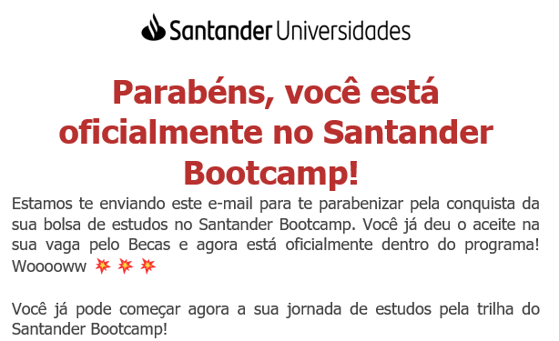

Hoje recebi o tão esperado email do Santander Universidades informando que fui aprovado no programa de bolsa de estudos em parceria com a DIO

A trilha escolhida foi a de Fullstack Developer

O bootcamp conta com 42 cursos, 6 desafios de projetos, 4 desafios de código e 1 live e está divido nos seguintes módulos:

#### Módulo 0 - Prepare-se para a Jornada

- [Curso] Conheça as Oportunidades da DIO ✅
- [Curso] Seja Protagonista Neste Bootcamp ✅
- [Live] Aula Inaugural - Santander Bootcamp Fullstack Developer (01/06/2022 às 19h)

#### Módulo 1 - Conteúdo de Abertura ✅

- [Curso] Boas-vindas ao Santander Bootcamp Fullstack Developer ✅
- [Curso] Introdução à Programação e Pensamento Computacional ✅
- [Curso] Introdução ao Git e ao GitHub ✅
- [Desafio de Projeto] Criando seu primeiro repositório no GitHub para compartilhar seu progresso ✅

#### Módulo 2 - HTML/CSS3/JavaScript

- [Curso] Introdução a criação de websites com HTML5 e CSS3 ✅
- [Curso] Posicionando elementos com Flexbox em CSS ✅
- [Desafio de Projeto] Recriando a página inicial do Instagram ✅
- [Curso] Introdução ao JavaScript ✅
- [Curso] Sintaxe e Operadores ✅
- [Curso] Variáveis e Tipos ✅
- [Curso] Funções ✅
- [Curso] Coleções ✅
- [Curso] Map, Filter e Reduce ✅
- [Curso] Debugging e Error Handling ✅
- [Curso] Javascript Assíncrono ✅
- [Curso] Orientação a objetos ✅
- [Desafio de código] Desafio Iniciais JS - Santander Fullstack Developer ✅
- [Curso] Trabalhando com módulos em JavaScript ✅
- [Curso] Manipulando a D.O.M. com JavaScript
- [Curso] Introdução ao TypeScript: Explorando Classes, Tipos e Interfaces ✅
- [Desafio de projeto] Introdução Prática ao TypeScript

#### Módulo 3 - Angular

- [Curso] Introdução ao Angular 8 ✅
- [Curso] Trabalhando com Páginas SPA com Angular ✅
- [Curso] A arquitetura de componentes e a gestão da complexidade no front-end ✅
- [Curso] Instalando e Preparando o Ambiente Angular
- [Curso] Explorando Diretivas com Angular ✅
- [Curso] Implementando Serviços e Injeção de Dependências com Angular ✅
- [Curso] Introdução a Serviços Assícronos no Angular
- [Curso] O Poder da Data Binding no Angular
- [Curso] Trabalhando com Componentes em Angular
- [Curso] Criação de Pipes com Angular
- [Desafio de código] Desafios Intermediários JS - Santander Fullstack Developer
- [Desafio de projeto] Como criar um front-end de um e-commerce utilizando Angular

#### Módulo 4 - Java

- [Curso] Dominando IDEs Java ✅
- [Curso] Variáveis, Tipos de Dados e Operadores Matemáticos em JAva ✅
- [Curso] Entendendo Métodos Java ✅
- [Curso] Lógica Condicional e Controle de Fluxo em Java ✅
- [Curso] Estruturas de Repetição e Arrays em Java ✅
- [Curso] Trabalhando com Collections Java ✅
- [Curso] Tratamento de Exceções em Java ✅
- [Curso] Debugging Java ✅
- [Curso] Programação Orientada a Objetos ✅
- [Desafio de código] Desafio Inicias Java - Santander Fullstack Developer
- [Desafio de projeto] Criando um Banco Digital com Java e Orientação a Objetos ✅

#### Módulo 5 - Spring Framework

- [Curso] Conhecendo os Principais Protocolos de Comunicação da Internet
- [Curso] Introdução ao framework Spring Boot ✅
- [Curso] Imersão no Spring Framework com Spring Boot ✅
- [Curso] Adicionando Segurança a uma API REST com Spring Security
- [Desafio de código] Desafios Intermediários Java - Santander Fullstack Developer
- [Desafio de projeto] Explorando Padrões de Projetos na Prática com Java ✅

#### Módulo 6 - Mentorias

- [Live] Mentoria 2 - Apresentação dos Projetos de Tecnologia do Santander (02/06/2022 às 16h)
- [Live] Mentoria 3 - Como criar componentes reutilizáveis em Angular (26/06/2022 às 16h)
- [Live] Mentoria 4 - Consumindo APIs a partir de front-ende Angular com um back-end Java (14/07/2022 às 16h)
- [Live] Mentoria 5 - Como se tornar um desenvolvedor de sucesso na Santander (28/07/2022 às 16h)
