Hoje *(26/04/2022)* iniciei a mentoria no Campus Expert da [DIO](https://dio.me/sign-up?ref=9MBHSZPLXL). Irei contar aqui um pouco de como é/foi participar do campus expert da dio.

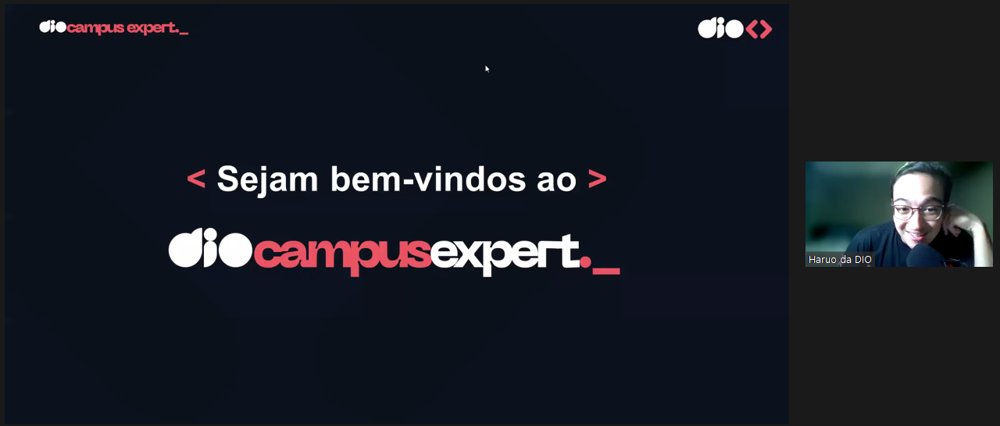

## Mentoria 1 - Victor Haruo (26/04)

### Como ser um DIO Campus Expert

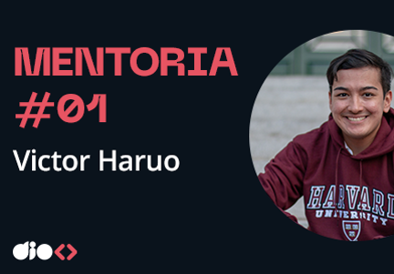

Hoje o Haruo apresentou o onboarding sobre o dio campus expert, mostrou o calendário das mentorias.

## Mentoria #2 - Karol Attekita (03/05)

### Desenvolvimento Mobile

> Atualizado 04/05

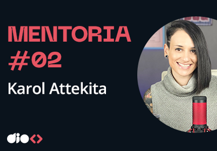

Neste segundo dia de mentoria, tivemos um bate-papo com a Karol Attekita sobre o desenvolvimento Mobile.
Abordou assuntos de como se destacar no mercado de trabalho e por onde começar: i- construir api para enviar e receber dados; ii- desenvolver interfaces e criar componentes UI. Realizou um analise no panorama autal para entender as possibilidades de mercado. Vimos que devemos focar e escolher uma tecnologia e nos desenvolver nela. Consolidar as softskills e hardskills.

Vimos algumas tecnologias como:

```text
iOS nativo (Swift / Objective C);
android nativo (Java / Kotlin);
flutter (híbrida / dart);
react native (híbrida / javascript);
xamarim (híbrida / c#);
Web (baseado em apps web).
```

Roadmap

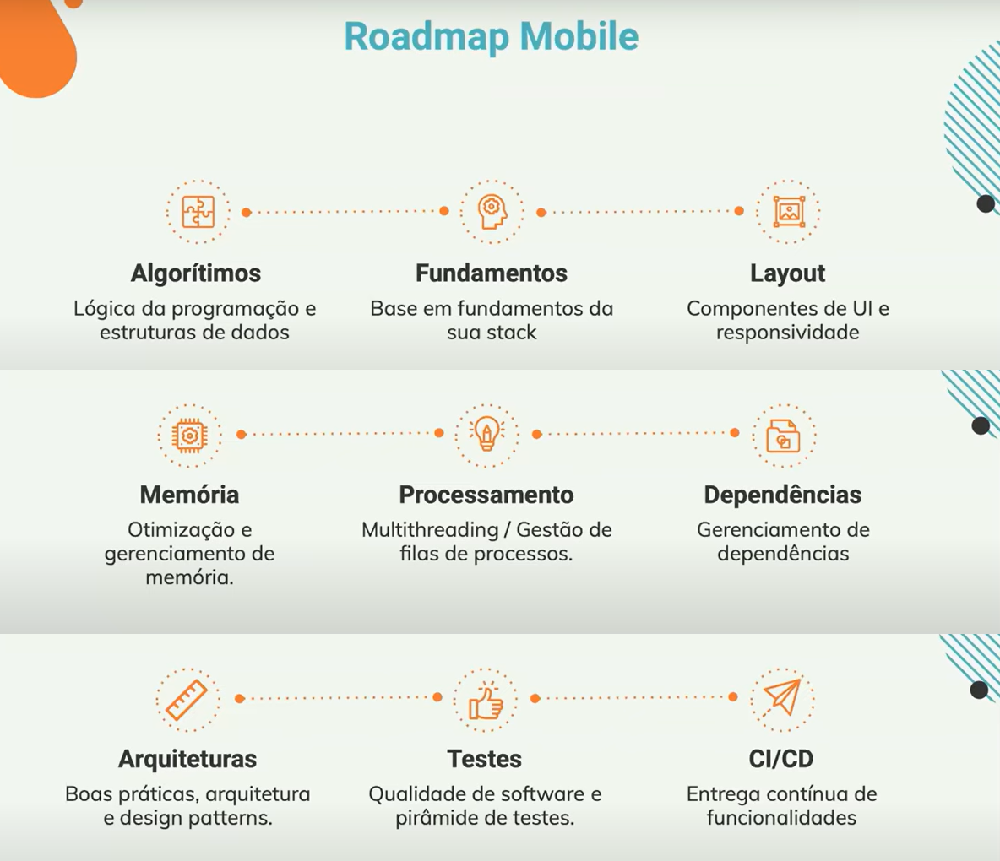

Principais metodologias:

```text
KISS;
SOLID;
TDD;
Regras de escoteiro.
```

## Mentoria #3 - Pablo Henrique (10/05)

### Desenvolvimento Front-End

> Atualizado 11/05

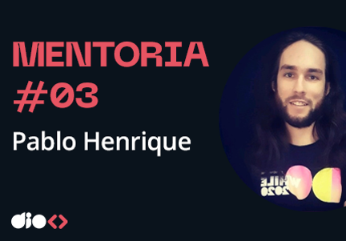

Nesta terceira mentoria, tivemos um bate-papo com Pablo Henrique, desenvolvedor full stack, sobre a carreira de front-end. Começamos com a apresentação dos 4 pilares:

```text
Soft skills:
    habilidades e competências relacionadas ao comportamento humamo

Hard skills:
    habilidades técnicas que podem ser quantificadas por instituição
    ou empresas;

Networking:
    é a sua rede de contatos, troca de informação relevante e com
    base na colaboração e ajuda recíproca.

Comunidade:
    um grupo para compartilhar informações em comum ou relacionada
```

Conversamos também sobre o porque de escolher o front-end e de que qual caminho seguir.

Roadmap:

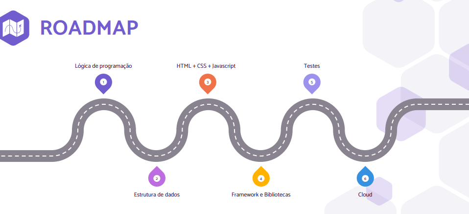

Frameworks

```text
Angular, vue, react, next
```

Manter o linkedin e github sempre atualizados, ajuda a ser encontrado por empresas e outras pessoas:

## Mentoria #4 - Carol Louzada (17/05)

### Qualidade de Software

> Atualizado 18/05

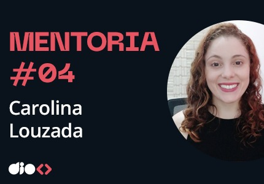

Na quarta mentoria, tivemos um bate-papo com Carol Louzada, Engenheira de Qualidade de Software, sobre QA.

Vimos um pouco sobre:

Mercado de trabalho e projeção de crescimento

Linguagens com maiores demandas no mercado web e mobile

```text
Python
C / C++ / C#
Java
```

Linguagens com maiores demandas no mercado para aplicações empresarias, desktop e científicas

```text
Python
C / C++ / C#
Java
Go
R
SQL
Swift
Ruby
```

Linguagens com maiores demandas no mercado para aplicações embacadas

```text
Python
C / C++ / C#
Java
Assembly
Rust
D
Arduíno
Ada
Verilog
```

Frameworks e Ferramentas para automação de testes UI - Web

```text
Selenium (C#, Ruby, Java, Python, JS)
WebDriverIO (JS)
Cypress
Robot Framework
Serenity
Cucumber
```

Frameworks e Ferramentas para automação de testes UI - Mobile

```text
Appium (android / ios)
Katalon (android / ios)
Espresso (android)
XCUI Test (ios)
```

Plataformas baseada em nuvem

```text
BrowserStack
AWS Device Farm
Sauce Labs
Perfecto
Cloud Test
```

Roadmap

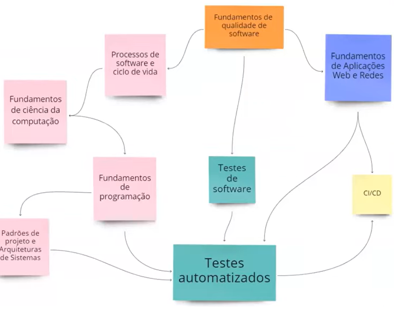

Pensando como QA

```text
Guardião da qualidade
Gerenciamento de defeitos
Análise e levantamento de cenários para histórias
Auxiliar desenvolvedores
Automação de testes:
    - Unidade, 
    - Integração,
    - Sistema, 
    - Performance / Desempenho
Testes manuais
```

Como ser diferente?

```text
Buscar ter uma mentalidade e conhecimento fullstack
Pensar criticamente
Pensar no custo-benefício
Não ter medo de perguntar
Se adaptar
Auxiliar a todos do time
Se importar com os processos
Networking e comunicação é essencial!
```

## Mentoria #5 - Bruno Dias (24/05)

### Segurança da Informação

> Atualizado 25/05

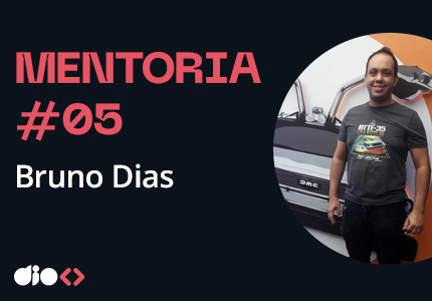

Na quinta mentoria, tivemos um bate papo com Bruno Dias (Analista Ofensivo) sobre a área de Segurança da Informação.

Mercado de Segurança super aquecido devida à:

```text
LGPD (Lei Geral de Proteção de Dados)
Ransonware
Guerra Cibernética
```

Por onde começar:

```text
Cursos
Leituras
Laboratórios
Práticas
CTF (capture the flag)
```

Linguagens mais utilizadas para a criação de scripts e ferramentas de automações:

```text
Python
JavaScript
Java
Assembly
```

Roadmap

```text
BlueTeam
RedTeam
PurpleTeam
DPO
Forense
Gestão
Auditoria
Análise de Malware
Controles
Redes
DSS
```

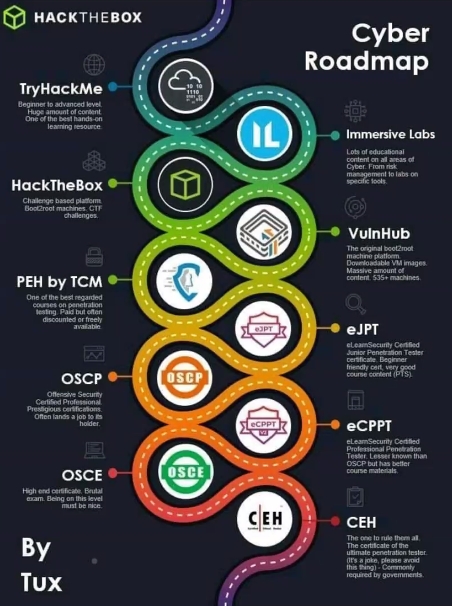

Diferencial

```text
Autoaprendizagem
Proatividade
```

Soft Skills

```text
Comunicação
Empatia
Trabalho cooperativo
Desenvoltura para ensinar e aprender
```

## Mentoria #6 - Juliana Mascarenhas (31/05)

### Data

> Atualizado 01/06


Hoje tivemos a mentoria com a Juliana Mascarenhas (Tech Education Specialist DIO) sobre como dominar a carreira em Data.

O mercado de Data

```text
Previsão de crescimento em torno de 500%;
Salários podem chegar até R$ 22k;
```

Perfil de um Engenheiro de dados

```text
Extração de dados de fontes heterogêneas;
Disponibilizar os dados para serem consumidos pelos analistas
e cientistas;
- Média salarial: R$ 7.621,00/mês
```

Perfil de um Cientista de dados

```text
Busca responder perguntas atreladas ao contexto do negócio;
Buscando insights através de técnicas de modelagem;
- Média salarial: R$ 8.330,00/mês
```

Perfil de um Analista de dados

```text
Busca entender o comportamento do negócio a partir dos dados;
Realiza o diagnóstico, identifica possíveis motivos para
comportamento e verifica métricas;
- Média salarial: R$ 4.274,00/mês
```

Outras carreiras

```text
BI - Business Intelligence Analyst
Logistic (Marketing Analyst)
Machine Learning Enginner
Data Architect
```

O que devo estudar?

```text
AWS
SQL
Data Modeling
Python
```

Hard Skills (Engenheiro de dados)

```text
SGBDs Relacional | NoSQL
Python | Java
Orquestração de containers | Clusterização
Arquitetura: mensageria e eventos
```

Hard Skills (Cientista de dados)

```text
Python | Scala | R
SGBDs
Viés: Machine Learning, Estatística, Network
```

Hard Skills (Analista de dados)

```text
Python
SGBDs
Dashboards - Power BI | Tableu | Qlik
Regras de negócio
```

O que vale a pena conhecer/estudar

```text
ETL - Extract | Transform | Load
Power BI
MatPlotLib
```

Roadmap

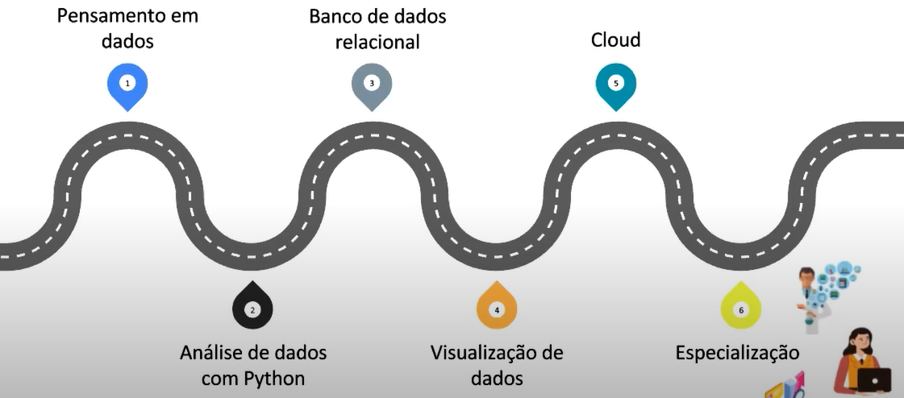

Diferencial

```text
Conhecer/entender:
* contexto dos dados
* modelos
* regras de negócios
* bibliotecas mais utilizadas
* retorno da métrica
```

Soft Skills

```text
Pensamento critíco
Colaborativo
Resiliência
Proatividade
Comunicação
Olhar Analitíco
```

## Mentoria #7 - Nathally Souza (07/06)

### Back-End

> Atualizado 08/06

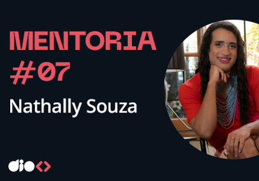

Na setima mentoria, tivemos um bate papo com Nathally Souza (Desenvolvedora na Thoughtworks e Instrutora na DIO) sobre a área de Back-End.

O que priorizar nos estudos de back-end

```text
Lógica de programação
Estrutura de dados
Programação orientada a objetos
Escolher uma linguagem:
    JavaScript
    TypeScript
    Java
    Python
Banco de Dados
Clean Code
Design Patterns
```

Conceito de API Rest

```text
Métodos HTTP (GET, POST, PUT, PATCH, DELETE)
Statuso HTTP
Recursos em uma API
```

Testes automatizados

```text
Pirâmide de testes
Testes unitários
Testes de integração / e2e
CI / CD
```

Microsserviços

```text
Conceito
Aplicação
Quando utilizar?
```

 Mentoria #8 - Iglá Generoso (14/06)

## Graduação do Campus Expert - Turma 3

### 🎊🎉🎊🎉🎊🎉🎊🎉🎊🎉🎊🎉🎊

> Atualizado 15/06

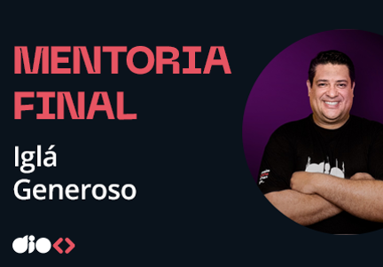

Hoje finalizamos as mentorias e concluimos a graduação da DIO Campus Expert - Turma 3.

Nesta mentoria batemos um papo com o CEO e fundador da DIO, Iglá Generoso. Onde ele contou um pouco sobre a sua história e sua trajetoria profissonal.

### Certificado de Conclusão

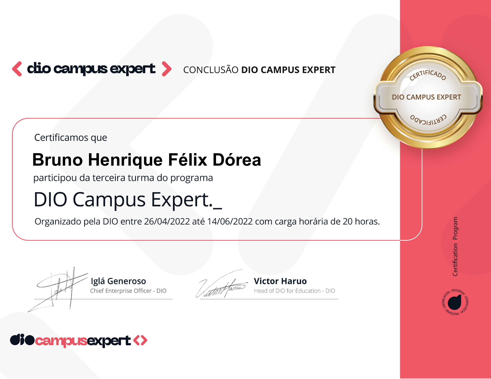

#### Próximos passos

Após a finalização dessa turma, iremos participar de alguns Workshops da comunidade Alumini.
