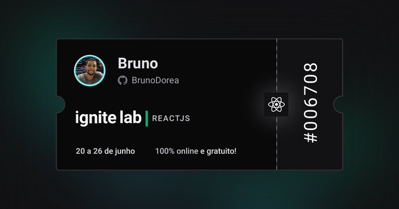
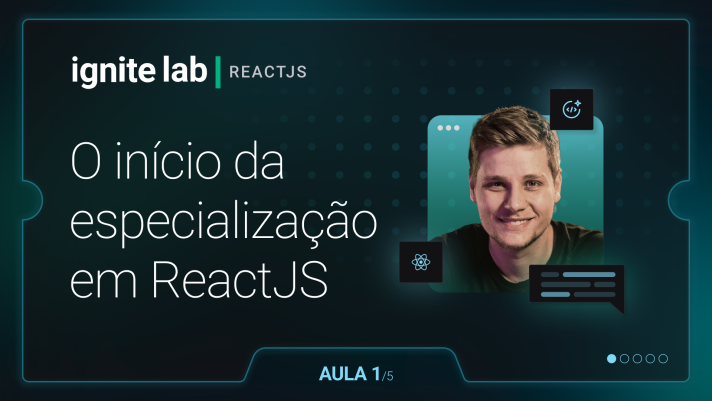
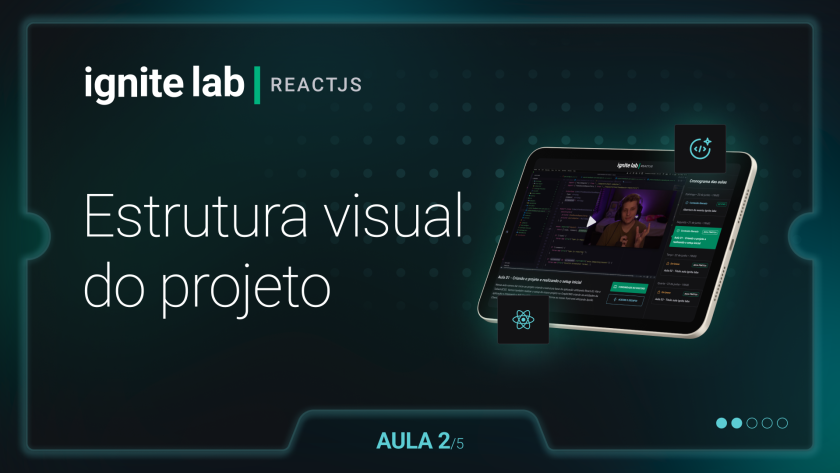
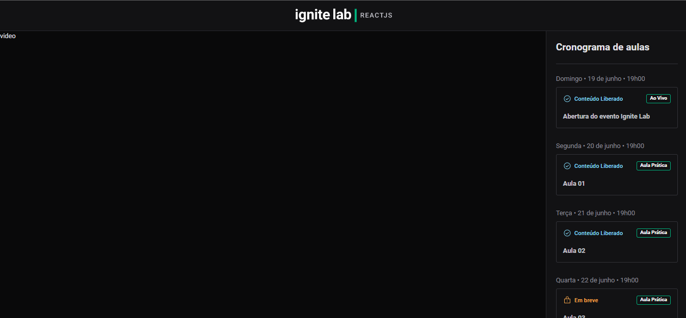
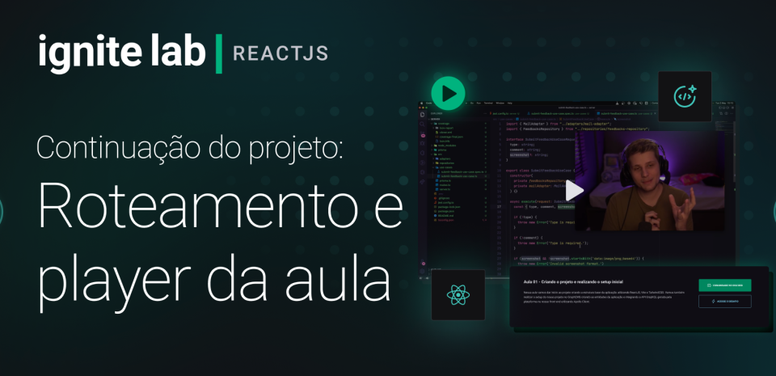
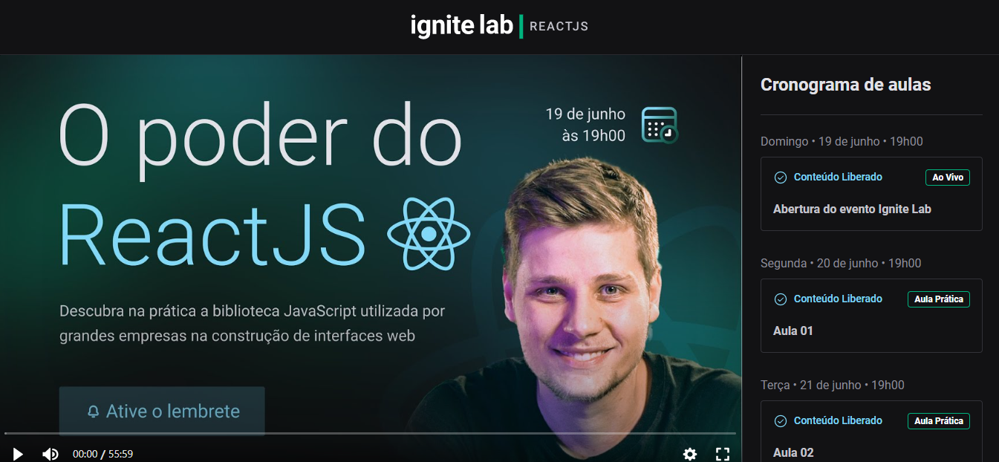
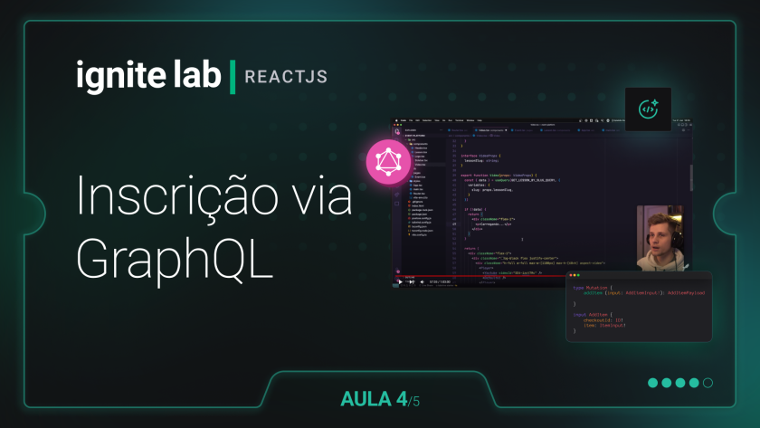
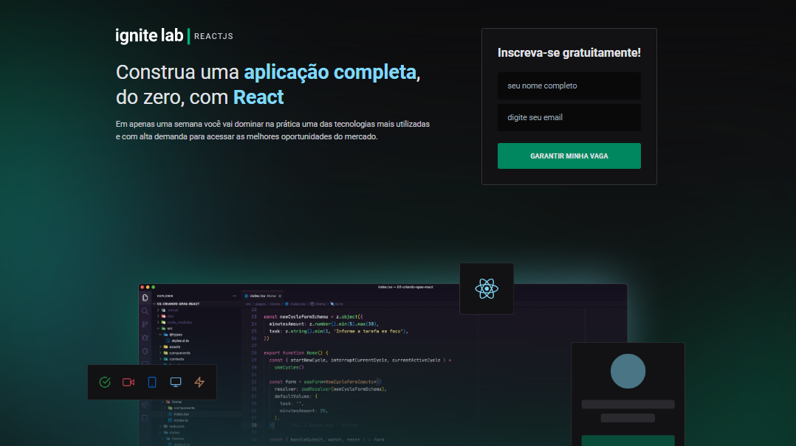
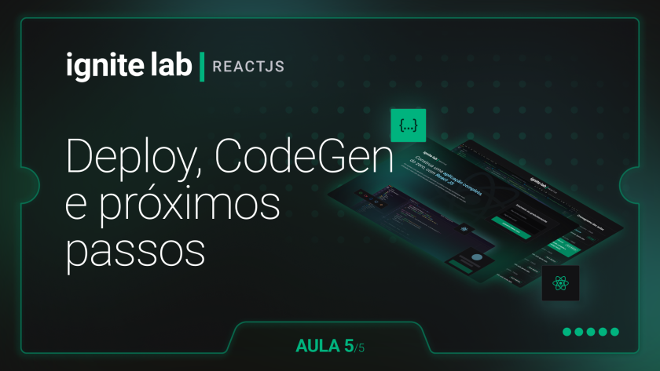

Hoje (21/06/2022) inicei o evento de 5 aulas da Rocketseat [Ignite Labs: ReactJS](https://evento.rocketseat.com.br/ignite-lab/) da **Rocketseat** com **Diego Fernandes**. Neste evento iremos desenvolver uma plataforma de evento com a parte de cadastro/inscrição e parte do conteúdo.

Irei compartilhar aqui alguns conhecimentos adquiridos com este evento.



Acompanhe o projeto [aqui](https://ignite-labs-reactjs.vercel.app/).

[GraphCMS](https://app.graphcms.com/4a57b7c538f842ddbef090c87346e041/master)

## Aula 1: O início da especialização em ReactJS



Nesta aula começamos com a criação do projeto e a instalação do vite com o comando:

```cli
npm create vite@latest
```

Instalamos o TailwindCSS, PostCSS e AutoPreFixar

```cli
npm install tailwindcss postcss autoprefixer -D
```

Criando o arquivo de configuração

```cli
npm tailwindcss init -p
```

Instalando o apollo graphQl

```cli
npm install @apollo/client graphql
```

Configurando o VSCode com as extensões utilizadas no projeto:

- GraphQL
- Tailwind CSS IntelliSense
- PostCSS Language Support

Headless CMS

```text
Painel de ADMIN (dados fornecidos através de uma API REST ou GraphQL) utilizando o GraphCMS.
```

Desafio Aula 1

[Post Twitter](https://twitter.com/brunoooooooo_/status/1539320601818517504)

[Post Linkedin](https://www.linkedin.com/feed/update/urn:li:activity:6945173284917231617/)

## Aula 2: Estrutura visual do projeto



Nesta aula desenvolvemos a estrutura visual do projeto. Realizamos as divisões dos componentes (Header, Sidebar, Video, Lesson).

Criamos o conteúdo e a estilização do Header, Sidebar e Lesson.

Utilizamos a fonte [Roboto](https://fonts.google.com/specimen/Roboto) do Google Fonts.

Instalando a biblioteca de icones

```cli
npm install phosphor-react
```

E também instalamos uma bliblioteca para formatar a data

```cli
npm install date-fns
```

## Status do projeto após a aula 2



Ao final da aula 2, já estava criado o header e o sidebar com o cronograma de aulas.

## Aula 3: Roteamento e player da aula



Nesta aula começamos a dar vida a parte do player de video. Fizemos a estilização e inserimos uma biblioteca para player de videos.

```cli
npm install @vime/core @vime/react
```

Instalamos também uma biblioteca para redirecionar as rotas da url

```cli
npm install react-router-dom
```

## Status do projeto após a aula 3



Ao final desta aula 3, conseguimos finalizar a área do vídeo e redirecionamento das aulas ao serem clicadas.

## Aula 4: Inscrição via GraphQL



Nesta 4 aula criamos a página de cadastro.

E instalamos tabém um nova biblioteca

```cli
npm install classnames
```

## Stastus do projeto após a aula 4

E assim ficou a página de inscrição.



## Aula 5: Deploy, CodeGen e próximos passos



Na última aula do evento, instalamos o CodeGen

```cli
npm install @graphql-codegen/typescript @graphql-codegen/typescript-operations @graphql-codegen/typescript-react-apollo --force
npm install @graphql-codegen/cli -D
```

## Conclusão do Evento

Queria deixar meu agradecimento especial ao **Diego Fernandes** pelo conteúdo deste evento e a **Rocketseat** por nos proporcionar eventos desta grandeza.
