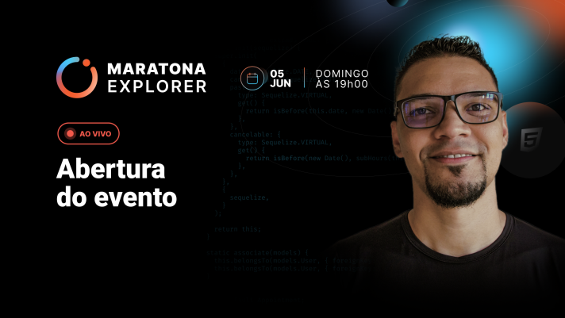
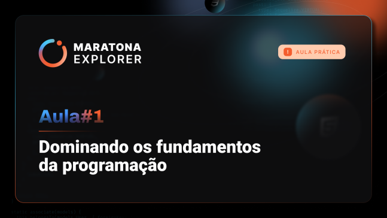
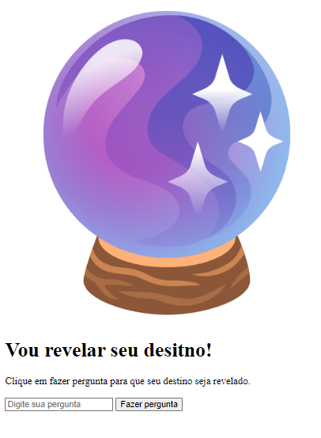
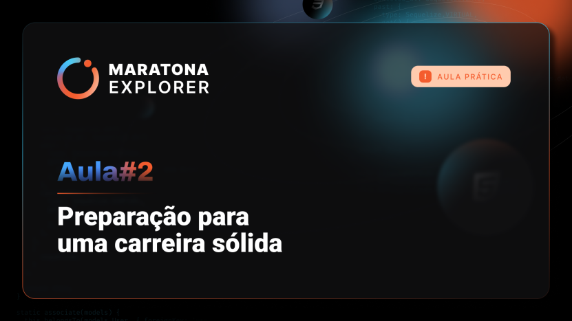
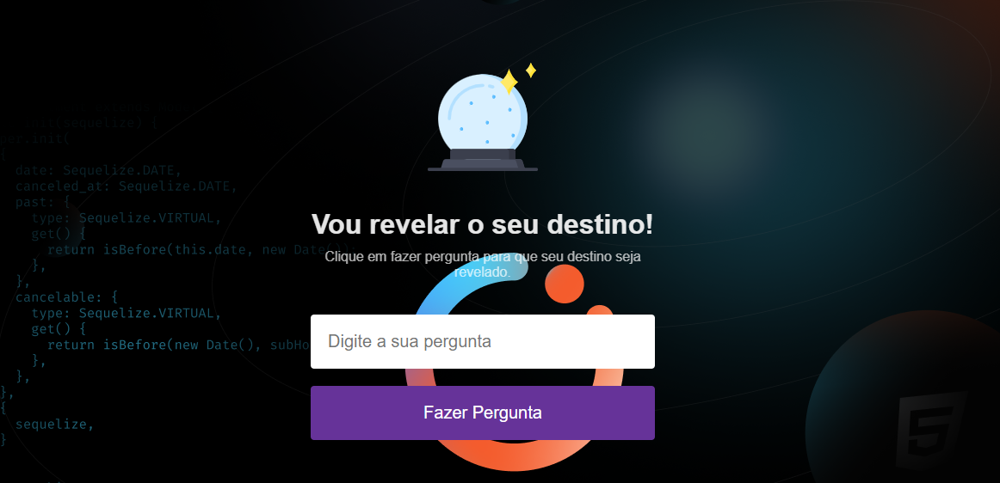
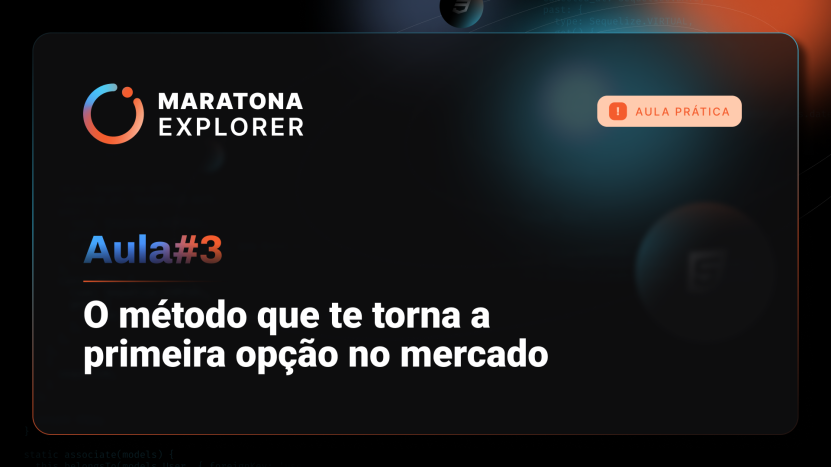
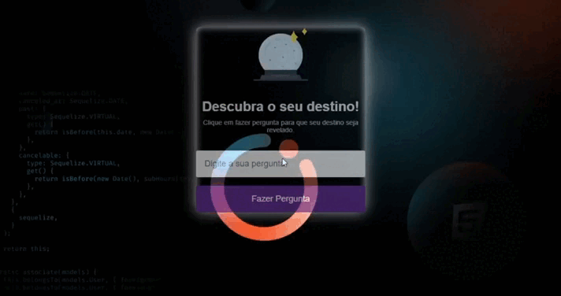

Hoje *(05/06/2022)* iniciei a [maratona explorer](https://evento.rocketseat.com.br/maratona-explorer/episodios/explorer/abertura/edicao/1) da **Rocketseat** com **Mayk Brito**.

Acompanhe o projeto [aqui](https://maratona-explorer-rocketseat.netlify.app/).



[Bônus - Wallpapers do Evento - Modelo 1](https://raw.githubusercontent.com/BrunoDorea/rocketseat-maratona-explorer/main/Maratona%20Explorer%20--%20Wallpaper%20Modelo%201/Maratona%20Explorer%20%20-%202560x1080.png?token=GHSAT0AAAAAABTVWMAVTVI6VH7KV7C7EX6AYU7NU7A)

[Bônus - Wallpapers do Evento - Modelo 2](https://raw.githubusercontent.com/BrunoDorea/rocketseat-maratona-explorer/main/Maratona%20Explorer%20--%20Wallpaper%20Modelo%202/Maratona%20Explorer%20%20-%202560x1080.png?token=GHSAT0AAAAAABTVWMAUOH3D763JPNRODJSGYU7NVUQ)

## Dia 1 + Revisão

### HTML

A aula 1 foi sobre "Dominando os fundamentos da programação" vimos algumas coisas sobre o crescimento do mercado de trabalho.



Tecnicas para estudar com eficiência:

```text
Aprendizado ativo x passivo
Metodologia PARE
    Perguntar
    Andar
    Revisar
    Explicar
```

Técnicas para acompanhar os vídeos:

```text
Tecnica "REC"
    Entender
    Codar
    Revisar
```

Ajuste de mentalidade

```txt
Fator TEMPO
Ter persistência
Progrmar é encontrar soluções!
```

E no final demos o primeiro passo para a criação do projeto do evento.



## Dia 2 + Revisão

### CSS

Nesta aula vimos o conceito de CSS e como utilizar o CSS para modificar o HTML.
E continuamos a estilização do projeto.



obs: fiz uma alteração no background do projeto para que ficasse mais bonito.



## Dia 3 + Revisão

### JavaScript

Na parte 3 vimos o conceito de JavaScript, como criar funções e de como utilizar o JavaScript para modificar o HTML.



O projeto final ficou desta forma.



Queria deixar meu agradecimento especial ao **Mayk Brito** pelo conteúdo deste evento e a **Rocketseat** por nos proporcionar eventos desta grandeza.
