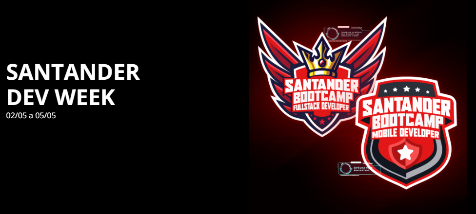
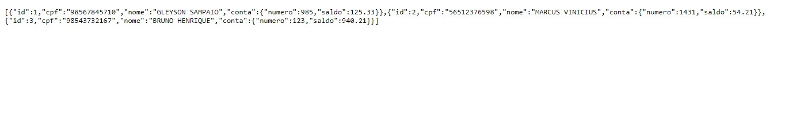
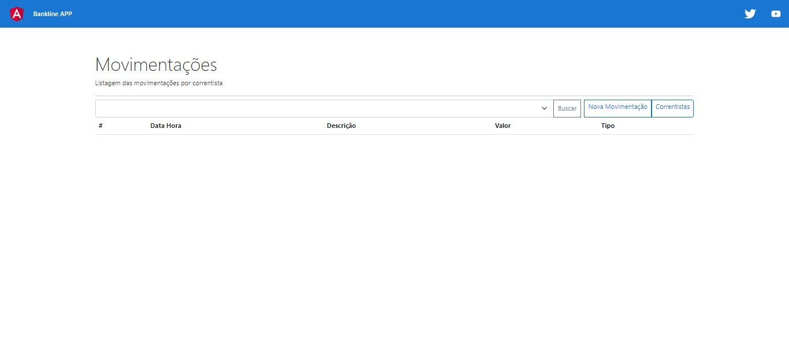

Está semana, acontece o evento do [Santander Dev Week_](https://www.dio.me/dev-week/santander/bootcamps). Serão 4 dias de imersão para construção de uma API Rest para criação de extrato bancário do Banco Santander na prática e do zero.



### Dia 1 - Preparando os Ambientes de Desenvolvimento  (02/05/2022)

> Atualizado 03/05

Hoje, no primeiro dia, o Iglá Generoso (CEO da DIO) e o Renan (Head da DIO), conversou com o George Garrido (IT do Santander \ F1RST) sobre o Santander Dev Week, além dos bootcamps do Santander Fullstack Developer e o Santander Mobile Developer.


Além da Live, também teve a aula 1 para a preparação dos ambientes de Desenvolvimento, junto com Gleyson Sampaio (Digytal) e Venilton Falvo Jr (DIO).

### Dia 2 - Abstraindo o Domínio Bancário em uma API REST com Java (03/05/2022)

> Atualizado 04/05

Na aula 2 criamos uma API Java com o Spring Boot utilizamos o Spring Initializr para a criação inicial do projeto, também criamos um banco de dados local com o PostgreSQL. Tive uma dificuldade pois estava utilizando duas IDE. Utilizei o VSCode como IDE principal, e estava rodando o Spring Boot no Eclipse. Também tivemos o erro ao realizar o deploy no Heroku devido ao problema de integração com o GitHub.

[Link do Repositorio da API](https://github.com/BrunoDorea/bankline-api)



### Dia 3 - Construindo um Front-end Angular de Extrato Bancário (04/05/2022)

> Atualizado 05/05

Na aula 3 criamos a interface web do projeto com Angular para consumir a API criada na anterior. Utilizamos inicialmente o nodeJs para instalação do Angular.

[Link do Repositorio do Projeto Web](https://github.com/BrunoDorea/bankline-app)

Aprendi alguns comandos para a utilização do Angular:

- Instalação do Angular na forma global

```text
ng install -g @angular/cli
```

- Para criar um novo projeto

```text
ng new 'nome_projeto'
```

- Para iniciar o servidor local, e abrir uma janela do navegador no final

```text
ng serve -o
```

- Para adicionar a biblioteca do Bootstrap

```text
ng add @ng-bootstrap/ng-bootstrap
```



### Dia 4 - Construindo um App Android de Extrato Bancário (05/05/2022)
