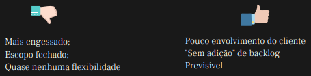
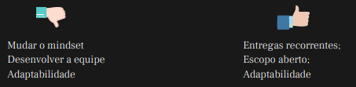
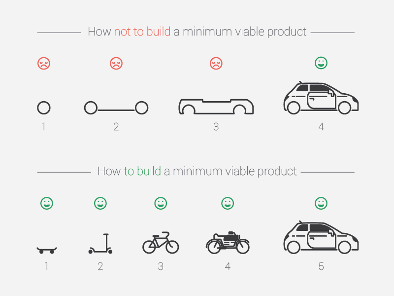

Hoje (23/06/2022) vamos iniciar o workshop sobre **Metodologias Ágeis** da DIO Campus Expert.

## Dia 1


Neste primeiro encontro o tema abordado foi **Cheguei no projeto e agora?**.

### Mas, o que é um projeto?

```text
o é um conjunto de ações realizadas de forma coordenada por uma
organização temporária, onde são alocados os insumos necessários
para alcançar um objetivo em um determinado prazo.
```

#### Agora que já sabemos o que é um projeto, e agora o que fazer?

1º Identificar as necessidades
2º Estabelecer e combinar objetivos
3º Ponderar demandas conflitantes (escopo, tempo, custo e QUALIDADE)
4º Administrar os objetivos sempre considerando as
prioridades e expectativas dos stakeholders.

#### Defina estratégias

```text
Quebre o escopo em tarefas
Conheça a necessidade do cliente
Construa backlogs
Desenvolva baseando-se em prioridades
```

Gerenciar um projeto implica em utilizar uma boa base para definir e planejar todo o trabalho realizado.

#### Método Tradicional vs Método Ágil

#### Vantagens e desvantagens

Método Tradicional



Método Ágil


#### Ciclo de vida do projeto

Em resumo e de forma genérica, o ciclo de vida do projeto é composto por:

```text
Iniciação do projeto;
Organização e preparação do projeto;
Execução do trabalho;
Finalização do projeto
```

#### MVP (Minimum Viable Product)

O MVP ou mínimo produto viável é a versão mais simples possível de um produto, a qual pode ser disponibilizada para uso com objetivo de validar um certo conjunto de hipóteses de negócio.


